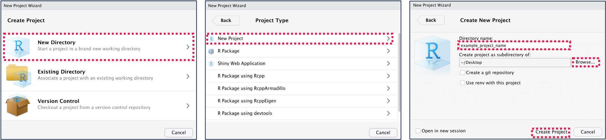

## RStudio Projects

Now that we'll start working with data files, it's a good idea to get into the habit of using RStudio Projects to organize your work..

By using **RStudio Projects**, you can ensure all the data, code, and documentation for your projects are accessible in a single place.

To create a new project, go to *File -\> New Project...\** from the top menu. In the window the appears, select *New Directory -\> New Project*. Then give your project a name and choose where to save your project.

*\* Notes:*

-   *Creating or opening a new RStudio Project will close this tutorial. No worries though! You can resume this tutorial from where you left off in the new RStudio Project.*

-   *In older versions of RStudio, this may be displayed as Empty Project instead of New Project.*

This will create a new folder in the location where you chose to save your new project. In this folder, you should now see a *.Rproj* file. You can use this *.Rproj* file as a shortcut to opening your project in RStudio.

Go ahead and create a new *.Rproj* to organize your work for this course module. Inside of the project folder, create a new *data* directory. To do this, you can select *New Folder* from the menu in the **Files** pane, which is located at the bottom right of the RStudio window.

{width="100%"}

If you are following along in the RStudio console, go ahead and download [this csv file](https://drive.google.com/uc?export=download&id=1Br49EnqLiUUP-lGE2LO2ZA4WE1jVC23g), and add it to your *data* folder in your project.
